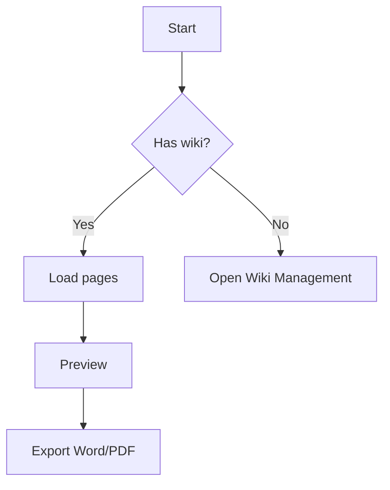
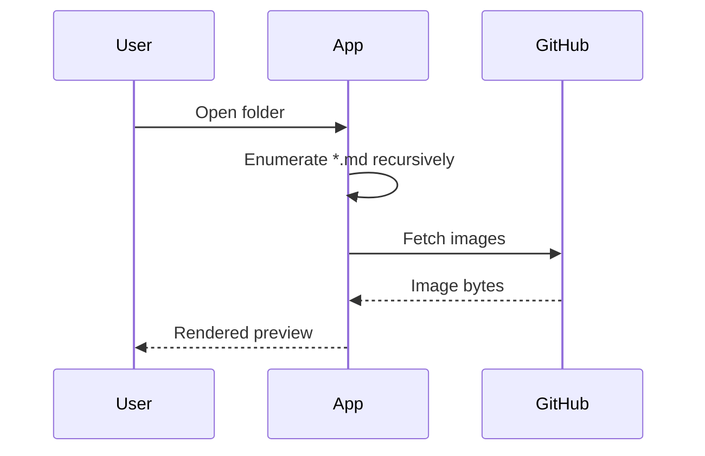
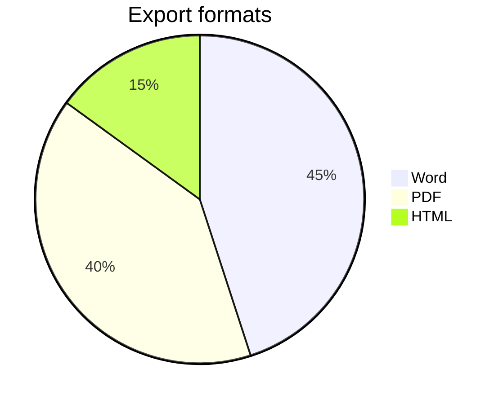

# Mermaid diagrams

These render live in the HTML preview and are rasterized to images for Word/PDF.

## Flowchart

## Sequence diagram

## Pie chart

## Azure DevOps `:::mermaid` container form

:::mermaid
graph LR
    X --> Y --> Z
:::
